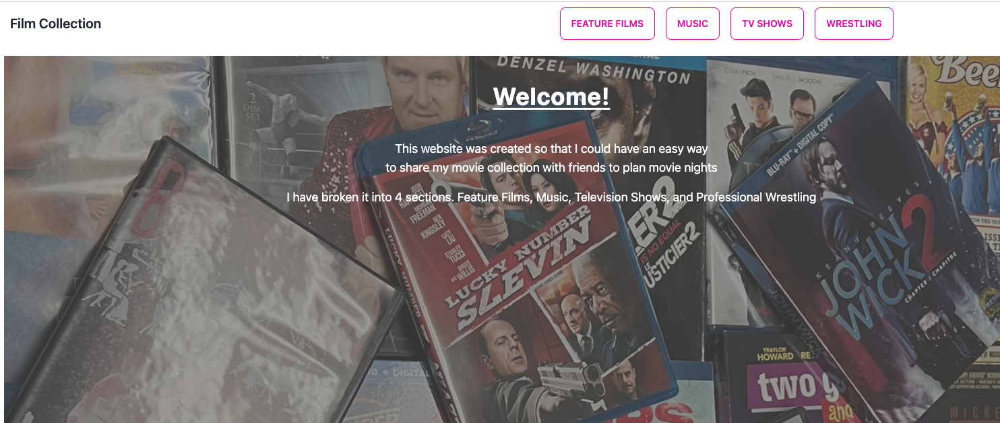

# scaling-winner

A NextJS app using MongoDB 

## Movie Database

- *What was your motivation?*  To make planning movie nights easier
- *What problem does it solve?*  Trying to list every movie somebody might be interested in watching when trying to figure out what we want to watch

## Usage

Go to https://scaling-winner.vercel.app/ and the page should load and the user can navigate through categories and sub-categories. 

Below is a screenshot of what the site should look like once you've gotten to the Note Taker. 

## Credits
I used next.js documentation on how to write API calls in Next.JS to call from a MongoDB. I used Vercel documentation on how to deploy to vercel